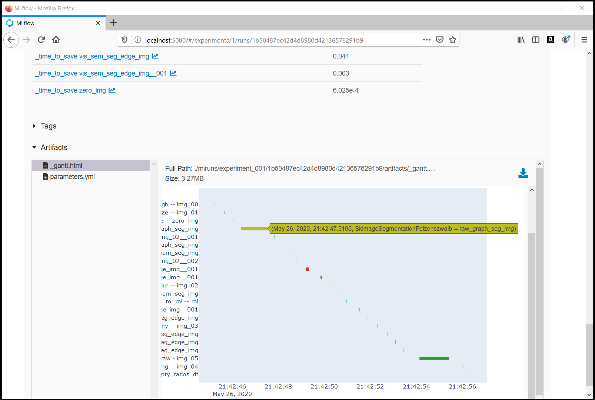

# Pipelinex Image Processing

An example project using [PipelineX](https://github.com/Minyus/pipelinex), Kedro, OpenCV, Scikit-image, and TensorFlow/Keras for image processing.

<p align="center">

Pipeline visualized by Kedro-viz
</p>

## Directories

- `conf`
  - YAML config files for PipelineX project
- `data`
  - empty folders (output files will be saved here)
- `logs`
  - empty folders (log files will be saved here)
- `src`
  - `empty_area.py`
    - The algorithm to estimate empty area ratio
  - `roi.py`
    - Supplementary algorithm to compute ROI (Region of Interest) from segmentation image
  - `semantic_segmentation.py`
    - Semantic segmentation using PSPNet model pretrained with ADE20K dataset

## How to run the code

### 1. Install Python packages

```bash
$ pip install pipelinex opencv-python scikit-image ocrd-fork-pylsd Pillow pandas numpy requests kedro mlflow kedro-viz
```

Note: `mlflow` and `kedro-viz` are optional.

#### [Optional] To use the pretrained TensorFlow model:

##### Install tensorflow 1.x and keras-segmentation

```bash
$ pip install "tensorflow<2" keras-segmentation Keras 
```

##### If you want to use TensorFlow 2.x, install fork of keras-segmentation modified to work with TensorFlow 2.x

```bash
$ pip install "tensorflow>=2.0.0" Keras 
$ pip install git+https://github.com/Minyus/image-segmentation-keras.git
```
### 2. Clone `https://github.com/Minyus/pipelinex_image_processing.git`

```bash
$ git clone https://github.com/Minyus/pipelinex_image_processing.git
$ cd pipelinex_image_processing
```

### 3. Run `main.py`

```bash
$ python main.py
```

As configured in [catalog.yml](https://github.com/Minyus/pipelinex_image_processing/blob/master/conf/base/catalog.yml), the following 2 images will be downloaded by http requests and then processed using `opencv-python`, `scikit-image`, and `ocrd-fork-pylsd` packages.


### 4. [Optional] View the experiment logs in MLflow's UI 

```bash
$ mlflow server --host 0.0.0.0 --backend-store-uri sqlite:///mlruns/sqlite.db --default-artifact-root ./mlruns/experiment_001
```

<p align="center">

Experiment logs in MLflow's UI
</p>


## Tested environment

- Python 3.6.8


## Simplified Kedro project template

This project was created from the GitHub template repository at https://github.com/Minyus/pipelinex_template

To use for a new project, fork the template repository and hit `Use this template` button next to `Clone or download`.

<p align="center">

</p>
